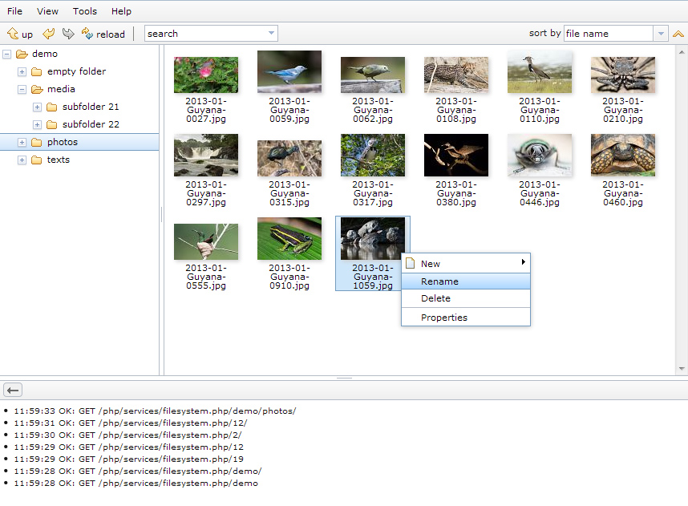

This web application manages files and folders on a remote web server directly within your browser. It copies the behavior of Windows Explorer.
remoteFileExplorer (rfe) is programmed in JavaScript using dojo on the client side and PHP on the server side.
All communication with the web server is done through REST.

Working [demo of the remoteFileExplorer](http://www.speich.net/projects/programming/remoteFileExplorer.php/demo/photos)

## Features
* REST-based file operations on remote server (create, rename and delete)
* lazy loading combined with client-side caching of files and folders
* move or copy (multiple) files and folder with drag and drop
* keyboard support
* switch between list or icons view of files and folders
* vertical or horizontal layout with or without navigation pane (tree view)
* searching for files and folders
* sorting of files and folders
* access folders and files directly over the address bar of the browser
* net panel logging all requests and server errors
* remember opened folder and selection state
* server side automatic generation of thumbnails with caching

## JavaScript Dependencies
Requires the following dependencies to be installed:
* [The Dojo Toolkit](http://dojotoolkit.org) SDK version 1.9.1 or higher, mapped to /dojo
* [dgrid](https://github.com/SitePen/dgrid), v0.3.16 mapped to /dgrid
  Newer versions of dgrid won't work, because they rely on dstore instead of dojo/store
* [xstyle](https://github.com/kriszyp/xstyle), mapped to /xstyle
* [put-selector](https://github.com/kriszyp/put-selector), mapped to /put-selector

## PHP Dependencies
Requires the following additional extensions to be loaded:
* php_gd2.dll
* php_mbstring.dll
* php_exif
* php_pdo_sqlite.dll

## Installation
* Clone this repository anywhere into your web project
* Change all paths of the [dojoConfig in rfe.php](rfe.php#L16)
to point to your installation directory. Also set the [parameter origPageUrl](rfe.php#L40).
* Change the $path variable in [php/inc_lobal.php on line 16](php/inc_global.php#L16) to your installation directory
* See [code on page rfe.php](rfe.php) for more information

## Licence
The remoteFileExplorer (rfe) is available under the same dual BSD/AFL license as the Dojo Toolkit.
For more information on the license please see the [License Information](http://dojotoolkit.org/license).
The remoteFileExplorer (rfe) is Copyright (c) 2005-2013, Simon Speich. All rights reserved.